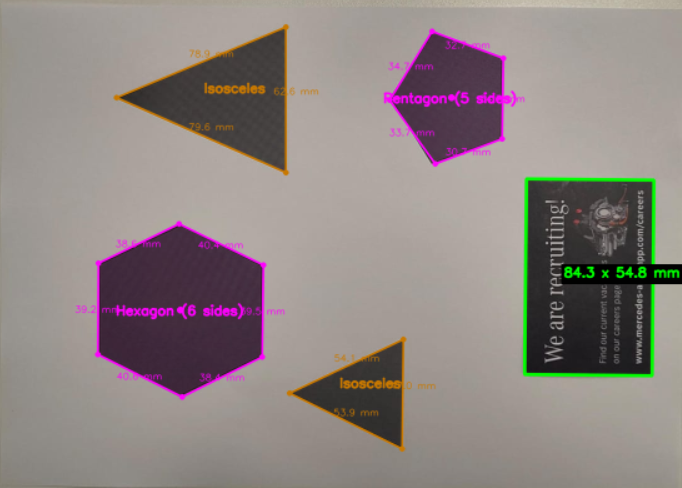
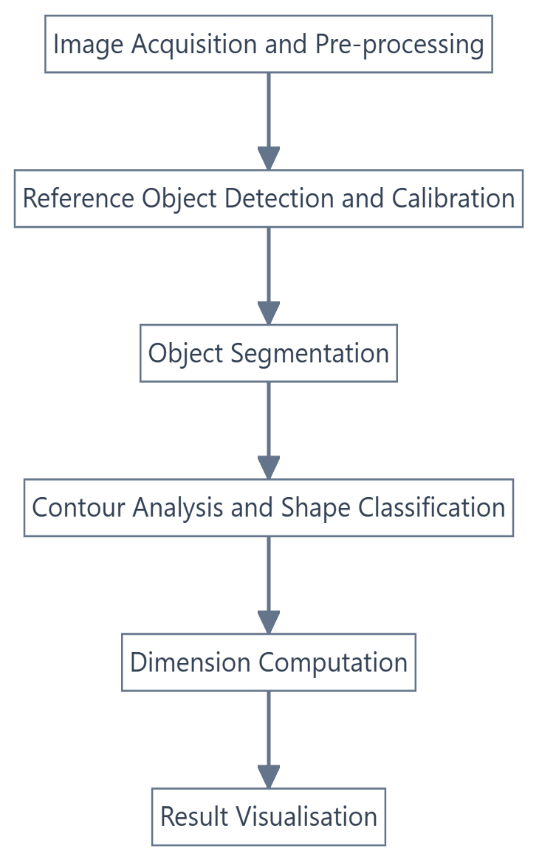
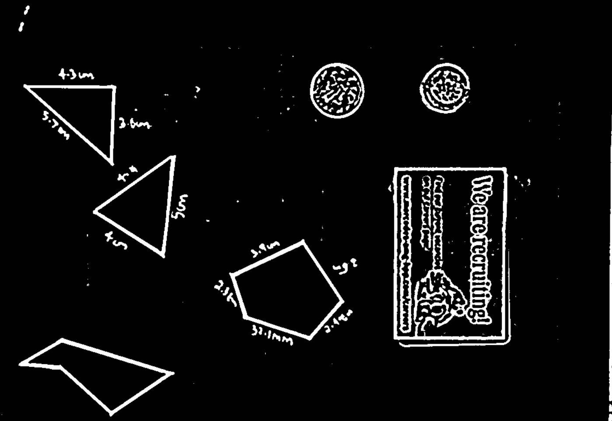
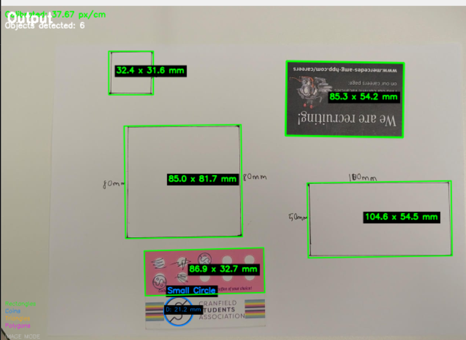
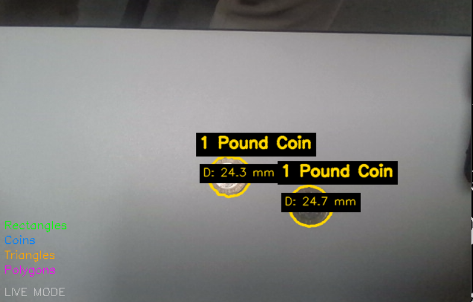
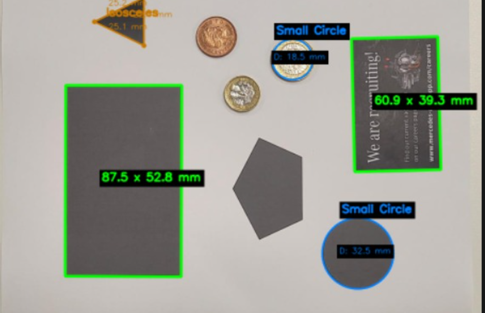

# Object Measurement System

**Real-time dimensional measurement with classical computer vision (C++ / OpenCV).**
Point a camera at a scene, show it a credit card, and the system calibrates itself and
measures the width, height, diameter or side lengths of everything else in view, in millimetres.
No machine learning is used.

*Built for the Machine Vision for Robotics module, MSc Robotics, Cranfield University (2025/26).*



## Highlights

- **Automatic calibration.** Detects an ISO/IEC 7810 ID-1 card (85.6 × 54 mm) and derives the pixel-to-mm scale with no manual input.
- **Four dedicated detectors** (rectangles, coins, triangles, polygons), run in a fixed priority order so calibration always happens before measurement.
- **Live camera and still-image modes**, with a brightness control and four debug windows for inspecting each pipeline stage.
- **Validated against a ruler and vernier callipers**, and stress-tested under changing light and camera tilt. Failure cases are documented below, not hidden.
- Classical techniques only: CLAHE, adaptive thresholding, contour analysis, Hough circles and polygon approximation.

## How it works



| Stage | What happens | OpenCV |
|---|---|---|
| Pre-processing | Brightness offset, grayscale, CLAHE (clip 2.0, 8×8 tiles), Gaussian blur (9×9, σ = 2), adaptive Gaussian threshold (block 15, C = 3) | `cvtColor`, `createCLAHE`, `GaussianBlur`, `adaptiveThreshold` |
| Calibration | Finds a card-shaped rectangle (4 corners, about 90° angles, aspect ratio 1.586 ± 10%) and computes pixels per cm from its size | `findContours`, `approxPolyDP`, `minAreaRect` |
| Segmentation | Extracts external contours; contours under 5000 px² or with extreme aspect ratios are rejected as noise | `findContours`, `contourArea` |
| Detection | Coins (Hough circles), rectangles, triangles, then polygons. Coin-like contours are kept out of the polygon detector by a circularity filter | `HoughCircles`, `approxPolyDP`, `minEnclosingCircle` |
| Output | Colour-coded labels, status line, FPS counter and legend | `drawContours`, `putText` |

Until the reference card is found, the display shows *"Show reference card to calibrate..."* and measurements are suppressed.



## Results

Measurements were compared with a 30 cm ruler and vernier callipers (±0.02 mm). Errors are absolute differences from ground truth.

| Group | Measurements | Mean error | Max error |
|---|---|---|---|
| Cards and coins (credit card, business card, £1, £2) | 10 | 0.7 mm | 1.3 mm |
| Drawn shapes of 30 to 100 mm (squares, rectangles, circles) | 11 | 2.9 mm | 5.0 mm |

Pentagon and hexagon side lengths were within about 3% on average, and the large triangle within 1%.

Standard objects measure well. Drawn shapes are less accurate, with relative errors up to 9% on some sides. Part of that comes from the tolerances of my own drawing and printing.

**Rectangles and squares**



**Coins**



### Robustness

| Condition | Outcome |
|---|---|
| Normal brightness | All objects detected and measured |
| Low brightness (slider at 37) | Objects detected, slight edge fragmentation affects small objects |
| High brightness (slider at 200) | Over-exposure fragments contours, and shapes can be misclassified |
| Camera tilt of 15° and 40° | Perspective error grows with tilt, and the card was not detected at one of the tested angles, so calibration failed |

## Known limitations

- **Reference ambiguity.** Calibration accepts a rectangle within ±10% of the card's aspect ratio. In a test with a business card and a larger grey rectangle of similar proportions, the system calibrated on the wrong object and every later measurement inherited the error.

  

  Possible fixes: a tighter ratio tolerance, a colour or texture check, or letting the user confirm the card.
- **Perspective.** The method assumes a top-down view of a flat plane. Steep tilt breaks the pixel-to-mm assumption and can stop the card being detected.
- **Lighting.** Strong glare or over-exposure fragments contours, and dark shapes on dark backgrounds need the brightness slider.
- **Speed.** The on-screen counter shows about 3 FPS in a Debug build with four preview windows. I have not profiled or optimised it.

## Ideas for improvement

Homography-based perspective correction, sub-pixel edge refinement (`cornerSubPix`), multiple reference objects, camera-intrinsics-based distance compensation, a Release-build performance pass, and a CMake build for Linux and macOS.

## Getting started

**Requirements:** Windows, a recent Visual Studio with the C++ desktop workload (the `.slnx` format needs 2022 17.10 or newer), and [OpenCV 4.x](https://opencv.org/releases/). The project was built with OpenCV 4.12 (`opencv_world4120`).

1. Extract OpenCV and set an environment variable `OPENCV_DIR` to that folder (the one containing `build\`).
2. Open `Opencv.slnx` and build the **Debug | x64** configuration.
3. Make `opencv_world4120d.dll` (in `OPENCV_DIR\build\x64\vc16\bin`) available by copying it next to the executable or adding that folder to your `PATH`.

The Debug configuration links `opencv_world4120d.lib`. A Release build would need `opencv_world4120.lib` instead.

### Running

```
==============================
   MEASUREMENT SYSTEM
==============================
Select mode:
  1 = Live Camera
  2 = Image File
```

**Live camera.** The default webcam opens. Hold a credit-card-sized card flat and fully visible. After it calibrates, other objects are measured in millimetres. `SPACE` saves an annotated snapshot, `ESC` exits, and the slider (0 to 200, 100 = normal) adjusts brightness.

**Image file.** Enter the full path to a `.jpg`, `.png`, `.bmp` or `.tiff` image. Windows paths with backslashes or quotes are accepted. Example photos are in [`test_images/`](test_images/).

### Tips

- Use even, diffuse lighting and a plain, light, flat background
- Keep the camera top-down and the card flat
- Keep objects fully in frame, not overlapping, and away from the card
- Place coins flat

## What it detects

| Shape | Colour | Output |
|---|---|---|
| Rectangles, squares | Green | Width × height (mm) |
| Coins (£1, £2, 2p) | Blue | Diameter (mm) |
| Triangles | Orange | Three side lengths (mm) and type |
| Pentagons, hexagons | Purple | All side lengths (mm) |

## Repository layout

```
Opencv.slnx                   Visual Studio solution
Opencv/
  Main.cpp                    Entry point and mode menu
  unified.cpp / Unified.h     Pipeline: runs all detectors, draws the output
  RectangleMeasurement.*      Rectangle detection and card calibration
  Coinmeasurement.*           Coin detection (Hough circles)
  triangleDetection.*         Triangle detection and classification
  PolygonDetection.*          Pentagon and hexagon detection
test_images/                  Example input photos
docs/figures/                 Pipeline diagram and example results
```

---

**Biswajeet Panda** · MSc Robotics, Cranfield University · [GitHub](https://github.com/biswajeetpandaisreal-arch) · [LinkedIn](https://www.linkedin.com/in/biswajeetpanda192/)
